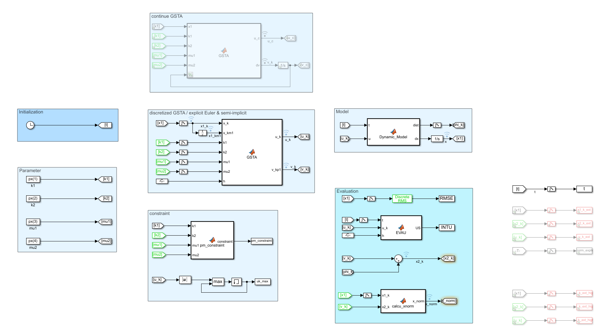
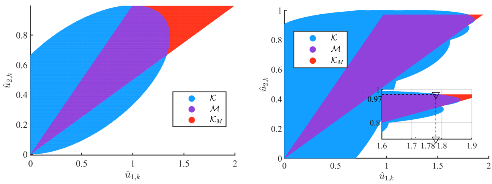
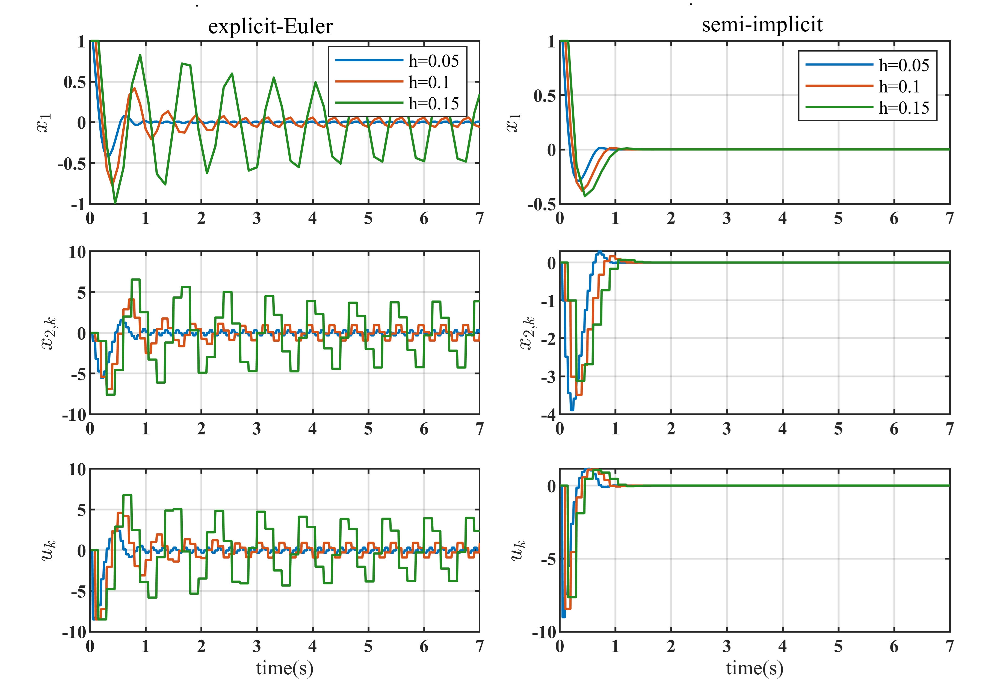

# semi-implicit of GSTA
source code of "Eigenvalue Mapping-based Semi-implicit Discretization of the Generalized Super-Twisting Algorithm"

## 1.Simulink model



## 2. Figure





## Citation

If you are considering using this repository, please reference the following:

```
@misc{https://doi.org/10.48550/arxiv.2209.03825,
  doi = {10.48550/ARXIV.2209.03825},
  url = {https://arxiv.org/abs/2209.03825},
  author = {Ding, Ningning},
  keywords = {Systems and Control (eess.SY), FOS: Electrical engineering, electronic engineering, information engineering, FOS: Electrical engineering, electronic engineering, information engineering},
  title = {Eigenvalue Mapping-based Semi-implicit Discretization of the Generalized Super-Twisting Algorithm},
  publisher = {arXiv},
  year = {2022},
  copyright = {arXiv.org perpetual, non-exclusive license}
}
```

## Contribution
You are welcome contributing to the package by opening a pull-request

## License
MIT License